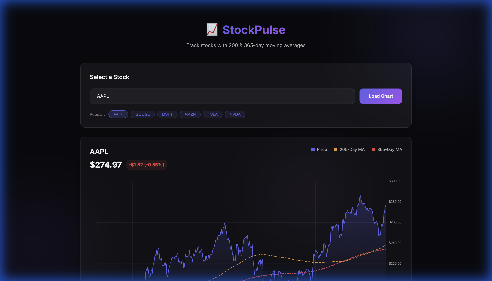

# StockPulse 📈

A beautiful stock tracker webapp with 200-day and 365-day moving averages.



## Features

- 📊 **Interactive Charts** - Real-time stock data with smooth visualizations
- 📈 **Moving Averages** - 200-day (orange) and 365-day (red) MA lines
- 🔍 **Smart Search** - Search by stock name ("Apple") or ticker ("AAPL")
- 📱 **Responsive Design** - Works on desktop and mobile
- 🎨 **Dark Theme** - Modern glassmorphism UI

## Live Demo

Open `index.html` in your browser, or run a local server:

```bash
npx serve .
```

Then visit http://localhost:3000

## How It Works

- Fetches 5 years of historical data from Yahoo Finance
- Calculates moving averages on full dataset for accuracy
- Displays last 500 trading days (~2 years) on the chart
- Uses CORS proxy for browser-side API access

## Tech Stack

- **Vanilla JavaScript** - No frameworks
- **Chart.js** - Interactive chart rendering
- **Yahoo Finance API** - Stock data and search

## Files

```
stock-pulse/
├── index.html    # Main HTML structure
├── index.css     # Styling (dark theme, glassmorphism)
├── app.js        # API logic, chart rendering
└── README.md     # This file
```

## License

MIT
