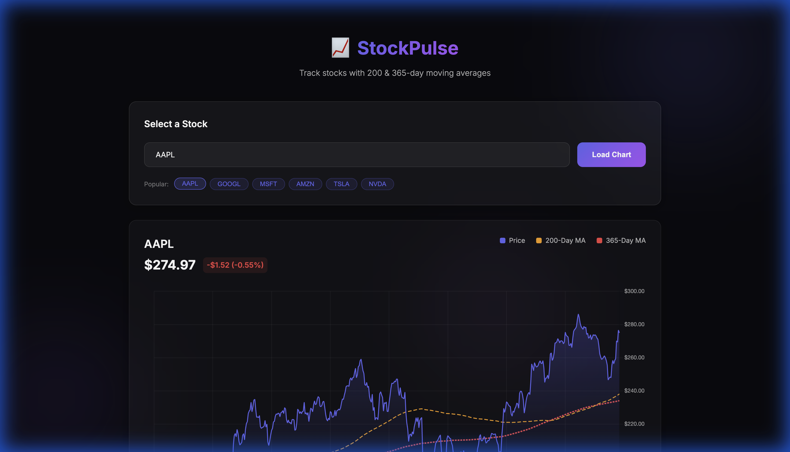

# StockPulse 📈

A beautiful stock tracker webapp with 200-day and 365-day moving averages.



## Features

- 📊 **Interactive Charts** - Real-time stock data with smooth visualizations
- 📈 **Moving Averages** - 200-day (orange) and 365-day (red) MA lines
- 🔍 **Smart Search** - Search by stock name ("Apple") or ticker ("AAPL")
- 📱 **Responsive Design** - Works on desktop and mobile
- 🎨 **Dark Theme** - Modern glassmorphism UI
- 📈 **Fundamentals** - P/E Ratio, PEG Ratio, Profit Margin
- 🔔 **Price Alerts** - Daily email alerts when stocks cross below their 200d/365d MA

## Live Demo

🚀 **[stock-pulse-7ok.pages.dev](https://stock-pulse-7ok.pages.dev)**

## How to Run Locally

Open `index.html` in your browser, or run a local server:

```bash
npx serve .
```

Then visit http://localhost:3000

## Deployment (Cloudflare Pages)

This project is deployed on Cloudflare Pages. To deploy your own instance:

### Option 1: Connect GitHub Repository

1. Go to [Cloudflare Dashboard](https://dash.cloudflare.com/)
2. Navigate to **Workers & Pages** → **Create application** → **Pages**
3. Select **Connect to Git** and choose your repository
4. Configure build settings:
   - **Build command**: Leave empty (static site)
   - **Build output directory**: `/`
5. Click **Save and Deploy**

### Option 2: Direct Upload

```bash
# Install Wrangler CLI (if not already installed)
npm install -g wrangler

# Login to Cloudflare
wrangler login

# Deploy to Pages
wrangler pages deploy . --project-name=stock-pulse
```

### Auto-Deploy

Once connected to GitHub, Cloudflare Pages will automatically deploy on every push to the main branch:

```bash
git add .
git commit -m "Your changes"
git push origin main
```

## How It Works

- Fetches 5 years of historical data from Yahoo Finance
- Calculates moving averages on full dataset for accuracy
- Displays last 500 trading days (~2 years) on the chart
- Uses CORS proxy for browser-side API access
- Fetches fundamental data (P/E, PEG, Profit Margin) from **Alpha Vantage**

## Tech Stack

- **Vanilla JavaScript** - No frameworks
- **Chart.js** - Interactive chart rendering
- **Yahoo Finance API** - Stock price history and search
- **Alpha Vantage API** - Fundamental data (P/E, PEG, Profit Margin)
- **Cloudflare Pages** - Hosting and serverless functions

## Files

```
stock-pulse/
├── index.html           # Main HTML structure
├── index.css            # Styling (dark theme, glassmorphism)
├── app.js               # API logic, chart rendering, alerts UI
├── functions/
│   └── api/
│       ├── proxy.js          # CORS proxy for Yahoo Finance
│       └── fundamentals.js   # Alpha Vantage + Finnhub fundamentals proxy
├── worker/                   # Cloudflare Worker for scheduled alerts
│   ├── wrangler.toml         # Worker config (KV bindings, cron trigger)
│   ├── package.json
│   └── src/index.js          # Cron handler, MA crossover detection, email
├── scripts/
│   └── vwrp-ath-alert.js     # Local launchd-based ATH alert (legacy)
└── README.md
```

## Price Alerts (Cloudflare Worker)

Daily email alerts when a stock's price crosses **below** its 200-day or 365-day moving average. Runs as a separate Cloudflare Worker with a Cron Trigger (Pages Functions don't support scheduled jobs).

### How it works

1. **Cron** triggers the worker weekdays after market close (`22:00 UTC`).
2. For each ticker in your watchlist, the worker fetches daily closes from Yahoo Finance, computes 200d/365d MAs, and compares against the stored "was above" state.
3. If a price was above an MA and is now below it (a **crossover**), an email alert is sent.
4. State is persisted in KV so missed runs still detect the crossover on the next check.

### Setup

```bash
cd worker
npm install

# 1. Create KV namespaces
npx wrangler kv namespace create WATCHLIST
npx wrangler kv namespace create ALERT_STATE

# 2. Copy the namespace IDs printed above into wrangler.toml (replace REPLACE_WITH_...)

# 3. Set secrets
npx wrangler secret put RESEND_API_KEY       # from https://resend.com/api-keys
npx wrangler secret put RECIPIENT_EMAIL      # sahebmotiani@gmail.com (already in vars)
npx wrangler secret put ALERT_API_TOKEN      # pick a random secret string (protects watchlist endpoints)

# 4. Deploy
npx wrangler deploy
```

After deploying, note the worker URL (e.g. `https://stock-pulse-alerts.<your-subdomain>.workers.dev`) and update `ALERTS_WORKER_URL` in `app.js`. If you set an `ALERT_API_TOKEN`, also set it as `ALERTS_API_TOKEN` in `app.js`.

### Email provider

Alerts use [Resend](https://resend.com) (100 emails/day free) — same provider as Pick Pocket. The default sender is `onboarding@resend.dev` (Resend's shared testing domain). Once you verify your own domain in Resend, update `FROM_EMAIL` in `wrangler.toml` to e.g. `alerts@yourdomain.com`.

### Manual trigger

```bash
curl -X POST "https://stock-pulse-alerts.<sub>.workers.dev/api/alerts/check?token=<TOKEN>"
```

### Managing the watchlist

Use the **🔔 Price Alerts** card on the web app, or call the API directly:

```bash
# View watchlist
curl https://stock-pulse-alerts.<sub>.workers.dev/api/alerts

# Add a ticker
curl -X POST https://stock-pulse-alerts.<sub>.workers.dev/api/alerts \
  -H "Content-Type: application/json" \
  -H "Authorization: Bearer <TOKEN>" \
  -d '{"ticker":"AAPL"}'

# Remove a ticker
curl -X DELETE "https://stock-pulse-alerts.<sub>.workers.dev/api/alerts?ticker=AAPL" \
  -H "Authorization: Bearer <TOKEN>"
```

## License

MIT
